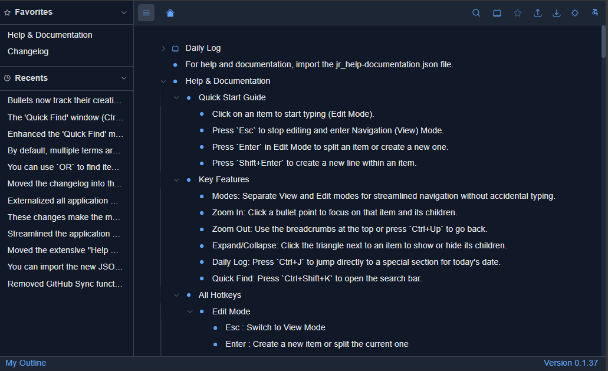

# Welcome by JaRoet Outliner

JaRoet Outliner is an outliner in the spirit of [Logseq](https://logseq.com), 
[Workflowy](https://workflowy.com) or [Dynalist](https://dynalist.com).
It works locally on your desktop. It is tested on Windows 11 and ChromeOS but other OS should work fine.
Now installation is needed other then unpacking a ZIP file to a folder. 

## Features

- An outline with unlimited nested bullets
- Local storage (IndexedDB) with export and import functions (to and from JSON)
- Keyboard navigation with arrow keys and hotkeys
- Unfold and fold bullets subbullets (recursive or not)
- Zoom in and zoom out on bullets setting it as the outline base (also know as hoisting)
- Support for moving bullets in an outline (currently limited)
- Support for internal links using `[[bullettext]]` and external links using `[linktext](link)` 
- Automatic recognition of emailaddresses and website URL's 

## Storage

The data is stored in an **IndexedDB** database managed by your browser. 
IndexedDB supports fairly large outlines. There is an export to JSON and a Import from JSON function 
in the topbar that you can use to backup your outline and restor it. 
On import you can choose a bullet anywhere in your outline under which the import will be put. 

As the IndexedDB is browser managed you will need to export and re-import the JSON file when 
you switch to another browser. I imported an Edge browser export JSON in Chrome and Opera without a 
problem. Using multiple browsers with this IndexedDB is not possible without importing. 

## Internet usage

The app itself does not uses the internet or any cloud resources for storage. 
Only on the very first run it will download some libararies from different CDN url's. 
This happens only on first start of the app. The libraries will be cached to prevent new downloads. 
When you change browser or clean your browsers history, those libraries will be downloaded again. 

The libraries downloaded are:
- **Tailwind CSS** (cdn.tailwindcss.com) - Used for the application's styling.
- **Babel Standalone** (unpkg.com) - Used to compile the JSX and TypeScript code directly within the browser.
- **Dexie.js** (unpkg.com) - A wrapper for IndexedDB used to store the outline data locally.
- **React** and **React DOM** (aistudiocdn.com) - The JavaScript library used for building the user interface.

## Screenshot

## Help-Documentation JSON file

There is in the ZIP file a help-documentation.json file that you can import into you outline. 
When you import this file into the root it will generate a `Help & Documentation` bullet. 
In the suboutline there is some explanation on how the app works and which hotkeys are available.
In the changelog you see all the changes made. It is generated by AI so every little change or 
bugfix is included. For a summary look at the release summary in Github releases for the repository. 

You can get there quickly from the app by clicking on the versionnumber in the lower right corner. 

